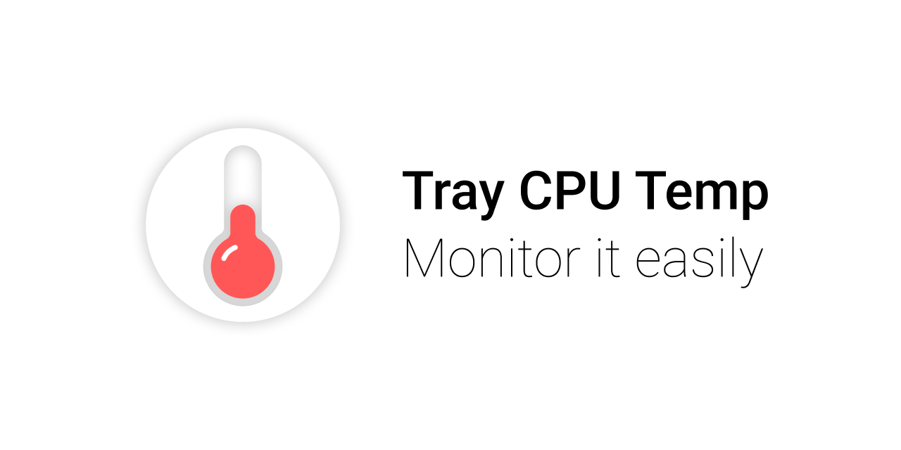
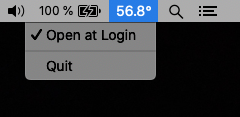

# Tray CPU Temp

App for displaying CPU temperature powered on [osx-cpu-temp](https://github.com/lavoiesl/osx-cpu-temp) and electron.

## Usage

Download the latest version of the app from releases page
or build your own from sources in this repo.

Run it.



You can enable autostart from the app menu in the system tray. 

## Development

Feel free to open the issues and improve the project
by forking it and sending pull requests 🙌


### How to build the app from sources 

Clone the repo

```
git clone https://github.com/talyguryn/tray-cpu-temp
cd ./tray-cpu-temp
```

Install node deps

```
yarn
```

Build osx-cpu-temp utility from sources

```
yarn get-binary-deps
```

Start the app

```
yarn start
```

Build the app

```
yarn build
```

### Where to find logs

```
cd ~/Library/Application\ Support/tray-cpu-temp/logs
```

## License 

MIT License

Copyright © 2022 Taly Guryn
